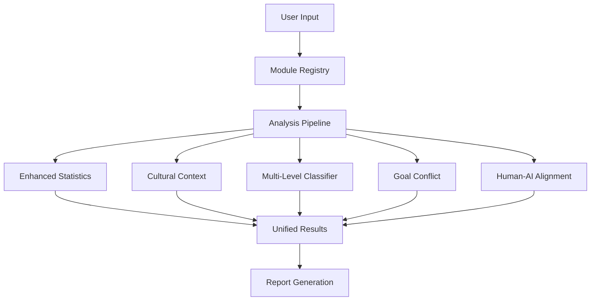

# 🛠️ Developer Guide

Welcome to the OpenAudit Developer Guide! This comprehensive guide will help you contribute to OpenAudit, create custom analysis modules, and extend the platform's capabilities.

## 🎯 **Overview**

OpenAudit is built with a modular, extensible architecture that makes it easy to:
- 🧩 **Create custom analysis modules**
- 🔌 **Extend existing functionality**
- 🤝 **Contribute to the core platform**
- 🌐 **Build integrations with other tools**

## 🏗️ **Architecture Overview**

### Core Components

```
OpenAudit/
├── core/                          # Core framework
│   ├── base_analyzer.py          # Module interface
│   ├── module_registry.py        # Module management
│   ├── analysis_profiles.py      # Profile configurations
│   ├── bias_testing_framework.py # Main testing engine
│   ├── model_manager.py          # AI model management
│   └── external_module_loader.py # Plugin system
├── templates/                     # Template system
│   ├── cv_templates/             # Resume templates
│   └── prompt_templates/         # Prompt templates
├── unified_interface.py          # Web API
├── cli.py                        # Command-line interface
└── docs/                         # Documentation
```

### Modular Architecture



## 🚀 **Development Setup**

### 1. Clone and Setup
```bash
# Clone repository
git clone https://github.com/openaudit/openaudit.git
cd openaudit

# Create virtual environment
python -m venv openaudit_dev
source openaudit_dev/bin/activate  # Linux/Mac
# openaudit_dev\Scripts\activate   # Windows

# Install development dependencies
pip install -r requirements-dev.txt
pip install -e .
```

### 2. Development Tools
```bash
# Install pre-commit hooks
pre-commit install

# Run tests
pytest

# Run linting
flake8 core/ tests/
black core/ tests/

# Type checking
mypy core/
```

### 3. Environment Setup
```bash
# Set up environment variables
export OPENAI_API_KEY="your-test-key"
export OPENAUDIT_DEV_MODE="true"
export OPENAUDIT_LOG_LEVEL="DEBUG"
```

## 🧩 **Creating Analysis Modules**

### Module Interface

All analysis modules must inherit from `BaseAnalysisModule`:

```python
from core.base_analyzer import BaseAnalysisModule, ModuleInfo, ModuleRequirements, ModuleCategory
from typing import Dict, List, Any

class MyCustomAnalyzer(BaseAnalysisModule):
    """Custom bias analysis module"""
    
    def _create_module_info(self) -> ModuleInfo:
        return ModuleInfo(
            name="My Custom Analyzer",
            version="1.0.0",
            description="Custom bias detection using my algorithm",
            author="Your Name",
            category=ModuleCategory.CUSTOM,
            tags=["custom", "bias", "analysis"],
            requirements=ModuleRequirements(
                min_samples=10,
                min_groups=2,
                data_types=["responses"],
                dependencies=["numpy", "pandas"],
                optional_dependencies=["matplotlib"]
            )
        )
    
    def analyze(self, data: Any, **kwargs) -> Dict[str, Any]:
        """Main analysis method"""
        # Your analysis logic here
        
        return {
            "summary": {
                "bias_detected": True,
                "confidence_score": 0.85,
                "total_samples": len(data)
            },
            "detailed_results": {
                "custom_metric": 0.42,
                "analysis_details": "..."
            },
            "key_findings": [
                "Found significant bias in group A vs B",
                "Effect size: large (d = 0.8)"
            ],
            "confidence_score": 0.85,
            "recommendations": [
                "Review training data for bias",
                "Implement bias mitigation strategies"
            ],
            "metadata": {
                "module": "my_custom_analyzer",
                "version": "1.0.0",
                "parameters": kwargs
            }
        }
    
    def get_requirements(self) -> Dict[str, Any]:
        """Return module requirements"""
        return self.module_info.requirements.__dict__
    
    def get_supported_data_types(self) -> List[str]:
        """Return supported data types"""
        return ["responses", "dataframe"]
    
    def validate_input(self, data: Any) -> bool:
        """Validate input data"""
        # Add your validation logic
        return True
```

### Quick Module Creation

Use the CLI to generate a module template:

```bash
# Generate module template
openaudit modules create my_analyzer \
    --author "Your Name" \
    --description "My custom analysis" \
    --category custom

# This creates:
# - external_modules/my_analyzer.py
# - external_modules/my_analyzer.manifest.json
```

### Module Registration

```python
from core.module_registry import register_module

# Register your module
success = register_module("my_analyzer", MyCustomAnalyzer)

if success:
    print("Module registered successfully!")
else:
    print("Registration failed")
```

### Advanced Module Features

#### 1. Dependency Management
```python
def check_dependencies(self) -> Dict[str, bool]:
    """Check if dependencies are available"""
    deps = {}
    try:
        import numpy
        deps["numpy"] = True
    except ImportError:
        deps["numpy"] = False
    
    return deps
```

#### 2. Configuration Options
```python
def get_configuration_options(self) -> Dict[str, Any]:
    """Return configurable options for this module"""
    return {
        "threshold": {
            "type": "float",
            "default": 0.5,
            "min": 0.0,
            "max": 1.0,
            "description": "Bias detection threshold"
        },
        "method": {
            "type": "choice",
            "choices": ["method_a", "method_b"],
            "default": "method_a",
            "description": "Analysis method to use"
        }
    }
```

#### 3. Progress Reporting
```python
def analyze(self, data: Any, progress_callback=None, **kwargs):
    """Analysis with progress reporting"""
    total_steps = 5
    
    for i, step in enumerate(["preprocessing", "analysis", "postprocessing", "validation", "reporting"]):
        # Do step work here
        if progress_callback:
            progress_callback(i + 1, total_steps, f"Executing {step}")
        
        # Your step logic here
    
    return results
```

## 🔌 **Plugin System**

### Loading External Modules

#### From File
```python
from core.external_module_loader import get_global_module_loader

loader = get_global_module_loader()

# Load module from file
result = loader.load_module_from_file(
    module_path="path/to/my_module.py",
    module_name="my_external_module",
    validate_security=True,
    auto_register=True
)

if result["success"]:
    print(f"Loaded module: {result['module_name']}")
else:
    print(f"Error: {result['error']}")
```

#### From GitHub
```python
# Load module from GitHub repository
result = loader.load_module_from_github(
    github_url="https://github.com/user/bias-analysis-module",
    module_name="github_module",
    branch="main",
    module_path="src/analyzer.py"  # Optional: specific file path
)
```

#### Create Module Template
```python
# Create a new module template
result = loader.create_module_template(
    module_name="my_new_analyzer",
    author="Your Name",
    description="My new bias detection algorithm"
)
```

### Security Validation

The plugin system includes security validation:

```python
from core.external_module_loader import ModuleSecurityValidator

validator = ModuleSecurityValidator(strict_mode=True)

# Validate source code
with open("external_module.py", "r") as f:
    source_code = f.read()

validation_result = validator.validate_source_code(source_code)

if validation_result["valid"]:
    print("✅ Module is safe to load")
else:
    print("❌ Security issues found:")
    for error in validation_result["errors"]:
        print(f"  - {error}")
```

## 🌐 **Web API Development**

### Adding New Endpoints

Add endpoints to `unified_interface.py`:

```python
@app.route("/api/my-custom-endpoint")
@api_error_handler
@log_performance()
def my_custom_endpoint():
    """Custom API endpoint"""
    # Your API logic here
    
    return jsonify({
        "status": "success",
        "data": results,
        "timestamp": datetime.now().isoformat()
    })
```

### API Error Handling

Use the built-in error handling decorator:

```python
from core.decorators import api_error_handler, ValidationError

@app.route("/api/my-endpoint")
@api_error_handler
def my_endpoint():
    # Validation
    if not request.json:
        raise ValidationError("Request body required")
    
    # Your logic here
    return jsonify({"success": True})
```

## 🖥️ **CLI Development**

### Adding CLI Commands

Extend the CLI in `cli.py`:

```python
def handle_my_command(self, args):
    """Handle my custom command"""
    print(f"Executing my command with args: {args}")
    
    # Your command logic here

# Add to command parser
def create_parser(self):
    # ... existing code ...
    
    # Add subcommand
    my_parser = subparsers.add_parser(
        'my-command',
        help='My custom command'
    )
    my_parser.add_argument('--option', help='My option')
    my_parser.set_defaults(func=self.handle_my_command)
```

## 🧪 **Testing**

### Writing Tests

Create tests in the `tests/` directory:

```python
import pytest
from core.bias_testing_framework import BiasAnalyzer
from core.module_registry import get_global_registry

class TestMyModule:
    """Test cases for my custom module"""
    
    def setup_method(self):
        """Setup for each test"""
        self.registry = get_global_registry()
        # Setup test data
    
    def test_module_registration(self):
        """Test module can be registered"""
        from my_module import MyCustomAnalyzer
        
        success = self.registry.register_module("test_module", MyCustomAnalyzer)
        assert success
        assert "test_module" in self.registry.get_available_modules()
    
    def test_module_analysis(self):
        """Test module analysis functionality"""
        # Create test data
        test_responses = [...]
        
        # Create analyzer
        analyzer = BiasAnalyzer(test_responses)
        
        # Run analysis
        results = analyzer.run_modular_analysis(["my_custom_analyzer"])
        
        # Assertions
        assert results["success"]
        assert "my_custom_analyzer" in results["module_results"]
    
    @pytest.mark.parametrize("input_data,expected", [
        (test_data_1, expected_1),
        (test_data_2, expected_2),
    ])
    def test_various_inputs(self, input_data, expected):
        """Test module with various inputs"""
        # Test logic here
        pass
```

### Running Tests

```bash
# Run all tests
pytest

# Run specific test file
pytest tests/test_my_module.py

# Run with coverage
pytest --cov=core tests/

# Run specific test
pytest tests/test_my_module.py::TestMyModule::test_module_registration
```

## 📊 **Performance Optimization**

### Profiling

```python
import cProfile
import pstats

def profile_analysis():
    """Profile analysis performance"""
    profiler = cProfile.Profile()
    profiler.enable()
    
    # Run your analysis
    analyzer = BiasAnalyzer(responses)
    results = analyzer.run_modular_analysis(["enhanced_stats"])
    
    profiler.disable()
    
    # Print stats
    stats = pstats.Stats(profiler)
    stats.sort_stats('cumulative')
    stats.print_stats(10)
```

### Optimization Techniques

#### 1. Vectorization
```python
import numpy as np
import pandas as pd

# Use vectorized operations instead of loops
def calculate_bias_vectorized(data):
    """Vectorized bias calculation"""
    # Instead of:
    # results = []
    # for group in groups:
    #     result = calculate_for_group(group)
    #     results.append(result)
    
    # Use:
    grouped = data.groupby('demographic')
    results = grouped.agg({'decision': ['mean', 'std', 'count']})
    return results
```

#### 2. Caching
```python
from functools import lru_cache

@lru_cache(maxsize=128)
def expensive_computation(data_hash):
    """Cache expensive computations"""
    # Expensive analysis here
    return results
```

#### 3. Parallel Processing
```python
from concurrent.futures import ProcessPoolExecutor
import multiprocessing as mp

def parallel_analysis(data_chunks):
    """Run analysis in parallel"""
    with ProcessPoolExecutor(max_workers=mp.cpu_count()) as executor:
        futures = [executor.submit(analyze_chunk, chunk) for chunk in data_chunks]
        results = [future.result() for future in futures]
    
    return combine_results(results)
```

## 🔧 **Configuration Management**

### Adding Configuration Options

```python
# In core/config.py
DEFAULT_CONFIG = {
    "analysis": {
        "alpha": 0.05,
        "effect_size_threshold": 0.3,
        "my_new_option": "default_value"
    }
}

def load_config():
    """Load configuration from file"""
    config_paths = [
        "~/.openaudit/config.yaml",
        "./config.yaml",
        "./openaudit.yaml"
    ]
    
    for path in config_paths:
        if os.path.exists(os.path.expanduser(path)):
            with open(os.path.expanduser(path)) as f:
                return yaml.safe_load(f)
    
    return DEFAULT_CONFIG
```

## 📚 **Documentation**

### Code Documentation

Follow the documentation standards:

```python
def analyze_bias(data: pd.DataFrame, 
                demographics: List[str],
                alpha: float = 0.05) -> Dict[str, Any]:
    """
    Analyze bias in model responses across demographic groups.
    
    Args:
        data: DataFrame containing model responses with demographic info
        demographics: List of demographic columns to analyze
        alpha: Significance level for statistical tests (default: 0.05)
    
    Returns:
        Dictionary containing:
        - bias_detected: Whether significant bias was found
        - bias_gaps: Dictionary of bias gaps by demographic
        - p_values: Statistical significance values
        - effect_sizes: Effect size measurements
        - recommendations: List of actionable recommendations
    
    Raises:
        ValidationError: If input data is invalid
        AnalysisError: If analysis fails
    
    Example:
        >>> data = pd.DataFrame({...})
        >>> results = analyze_bias(data, ["race", "gender"])
        >>> print(f"Bias detected: {results['bias_detected']}")
    
    Note:
        This function uses multiple statistical tests and applies
        Benjamini-Hochberg correction for multiple comparisons.
    """
    # Implementation here
```

### Adding to API Documentation

```python
@app.route("/api/my-endpoint", methods=["POST"])
@api_error_handler
def my_endpoint():
    """
    Custom analysis endpoint.
    
    ---
    tags:
      - Analysis
    parameters:
      - name: data
        in: body
        required: true
        schema:
          type: object
          properties:
            responses:
              type: array
              description: List of model responses
            options:
              type: object
              description: Analysis options
    responses:
      200:
        description: Analysis results
        schema:
          type: object
          properties:
            success:
              type: boolean
            results:
              type: object
    """
    # Implementation
```

## 🤝 **Contributing Guidelines**

### Code Style

Follow PEP 8 and use these tools:

```bash
# Format code
black core/ tests/

# Sort imports
isort core/ tests/

# Lint code
flake8 core/ tests/

# Type checking
mypy core/
```

### Commit Standards

Use conventional commits:

```bash
# Examples
git commit -m "feat: add new bias detection algorithm"
git commit -m "fix: resolve memory leak in analysis pipeline"
git commit -m "docs: update developer guide"
git commit -m "test: add tests for cultural context module"
```

### Pull Request Process

1. **Fork and Branch**
   ```bash
   git checkout -b feature/my-new-feature
   ```

2. **Make Changes**
   - Write code following style guidelines
   - Add tests for new functionality
   - Update documentation

3. **Test**
   ```bash
   pytest
   flake8 core/ tests/
   mypy core/
   ```

4. **Submit PR**
   - Clear description of changes
   - Reference any issues
   - Include test results

### Issue Reporting

When reporting issues:

```markdown
## Issue Description
Brief description of the problem

## Steps to Reproduce
1. Step one
2. Step two
3. Step three

## Expected Behavior
What should happen

## Actual Behavior
What actually happens

## Environment
- OS: 
- Python version:
- OpenAudit version:
- Dependencies:

## Additional Context
Any other relevant information
```

## 🔍 **Debugging**

### Logging

```python
import logging
from core.logging_config import get_logger

logger = get_logger(__name__)

def my_function():
    logger.debug("Starting analysis")
    logger.info("Processing 100 responses")
    logger.warning("Low sample size detected")
    logger.error("Analysis failed", exc_info=True)
```

### Debug Mode

```bash
# Enable debug mode
export OPENAUDIT_DEBUG=true
export OPENAUDIT_LOG_LEVEL=DEBUG

# Run with verbose output
openaudit analyze --verbose
```

### Common Issues

#### Module Not Loading
```python
# Check module validation
from core.validators import validate_module_interface

validation = validate_module_interface(MyModule)
if not validation["valid"]:
    for error in validation["errors"]:
        print(f"❌ {error}")
```

#### Memory Issues
```python
# Monitor memory usage
import psutil
import os

def check_memory():
    process = psutil.Process(os.getpid())
    print(f"Memory usage: {process.memory_info().rss / 1024 / 1024:.1f} MB")
```

## 🚀 **Deployment**

### Building Distribution

```bash
# Build package
python setup.py sdist bdist_wheel

# Check package
twine check dist/*

# Upload to PyPI (test)
twine upload --repository testpypi dist/*

# Upload to PyPI (production)
twine upload dist/*
```

### Docker Deployment

```dockerfile
FROM python:3.9-slim

WORKDIR /app
COPY requirements.txt .
RUN pip install -r requirements.txt

COPY . .
RUN pip install -e .

EXPOSE 5000
CMD ["openaudit", "start", "--host", "0.0.0.0"]
```

## 📈 **Monitoring & Analytics**

### Performance Monitoring

```python
from core.decorators import log_performance

@log_performance()
def my_analysis_function():
    """Function with performance logging"""
    # Your code here
    pass
```

### Usage Analytics

```python
def track_usage(module_name: str, execution_time: float):
    """Track module usage analytics"""
    analytics_data = {
        "module": module_name,
        "execution_time": execution_time,
        "timestamp": datetime.now().isoformat(),
        "version": get_version()
    }
    
    # Send to analytics service
    send_analytics(analytics_data)
```

## 🎓 **Advanced Topics**

### Custom Model Providers

```python
from core.model_manager import ModelProvider, ModelConfig

class MyCustomProvider:
    """Custom AI model provider"""
    
    def __init__(self, api_key: str):
        self.api_key = api_key
    
    async def generate_response(self, prompt: str, **kwargs) -> str:
        """Generate response from custom model"""
        # Your implementation here
        return response
```

### Custom Template Systems

```python
from core.template_manager import TemplateManager

class MyTemplateGenerator:
    """Custom template generator"""
    
    def generate_cv(self, variables: dict) -> str:
        """Generate CV from custom template"""
        # Your template logic here
        return formatted_cv
```

### Integration with Other Tools

```python
# MLflow integration
import mlflow

def log_experiment(results):
    """Log experiment to MLflow"""
    with mlflow.start_run():
        mlflow.log_params(results["parameters"])
        mlflow.log_metrics(results["metrics"])
        mlflow.log_artifacts("results/")
```

---

## 🎯 **Next Steps**

Ready to contribute? Here's what you can do:

1. **🏁 Start Small**: Pick a ["good first issue"](https://github.com/openaudit/openaudit/labels/good%20first%20issue)
2. **🧩 Create a Module**: Build a custom analysis module
3. **📚 Improve Docs**: Help improve documentation
4. **🐛 Fix Bugs**: Tackle open issues
5. **💡 Propose Features**: Share your ideas

## 📞 **Get Help**

- 💬 **Discord**: [Join our developer community - Coming Soon](#)
- 🐛 **Issues**: [GitHub Issues](https://github.com/openaudit/openaudit/issues)
- 📧 **Email**: jcadile@ur.rochester.edu
- 📖 **Docs**: [Full Documentation](README.md)

**Happy coding! 🎉** 